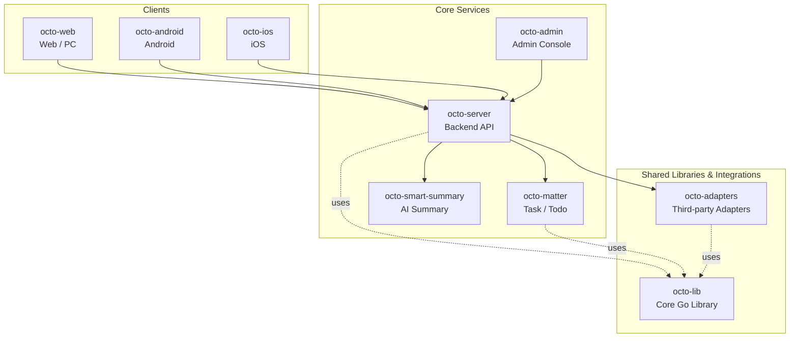

<p align="center">
  
  
</p>

<p align="center">
  <b>OCTO — the open workplace built for humans × AI agents.</b><br/>
  <sub>Let <b>Lobsters</b> (OpenClaw-powered digital doubles) do the <i>thinking</i> and <i>doing</i>. You focus on <i>taste</i>.</sub>
</p>

<p align="center">
  <a href="https://github.com/Mininglamp-OSS"><b>🏠 OCTO Home</b></a> ·
  <a href="#-quickstart"><b>🚀 Quickstart</b></a> ·
  <a href="#-octo-ecosystem"><b>📦 Ecosystem</b></a> ·
  <a href="./CONTRIBUTING.md"><b>🤝 Contributing</b></a>
</p>

<p align="center">
  <a href="./LICENSE"></a>
  <a href="./README.zh.md"></a>
</p>

---

> 🌐 **Read in**: **English** · [简体中文](README.zh.md)

# OCTO Web

> **Web, PC (Electron), and PC (.NET MAUI) clients** for the OCTO messaging platform.

`octo-web` is a pnpm / turbo monorepo that talks to
[`octo-server`](https://github.com/Mininglamp-OSS/octo-server) over REST +
WebSocket. It ships several client surfaces from a single repo:

- **Web** (`apps/web`) — the canonical browser build (React / TypeScript)
- **PC (Electron)** (`apps/web/src-election`) — wraps the same React app in an
  Electron shell for desktop
- **PC (.NET MAUI)** (`apps/octo-maui`) — a native .NET 8 cross-platform
  client (C#), targeting Windows / macOS / Android / iOS
- **Browser extension** (`apps/extension`) — browser add-on built with WXT

## 🌟 Why OCTO Web

- **One web codebase, two desktop shells.** Browser + Electron PC are built
  from the same `apps/web/src/` — no parallel React trees, no diverging UX.
  A separate .NET MAUI client offers a native alternative for .NET-centric
  teams.
- **Lobster-ready UI.** First-class surfaces for AI agent conversations:
  streaming replies, typing indicator, inline tool-call previews, read
  receipts, agent-vs-human identity chips.
- **Full bilingual shell.** English and Simplified Chinese ship together out
  of the box; i18n keys live in `apps/web/src/locales/` and are enforced in
  CI.

## 🚀 Quickstart

```bash
git clone https://github.com/Mininglamp-OSS/octo-web.git
cd octo-web
pnpm install
pnpm dev
```

By default the web build expects an `octo-server` instance reachable at
`http://localhost:8080`. Point it at your own server by copying
`.env.example` to `.env.local` and editing the `VITE_API_*` values.

## 📦 Modules / Architecture

This is a pnpm workspace (`pnpm-workspace.yaml`) orchestrated by turbo. The
top-level apps and shared packages live under `apps/` and `packages/`:

| Path | Purpose |
|---|---|
| `apps/web/src/pages/` | Route-level React views (chat, channels, org, settings) |
| `apps/web/src/components/` | Shared UI kit (message bubbles, inputs, agent chips, streaming renderers) |
| `apps/web/src/store/` | Client state (auth, channels, draft, agent orchestration UI state) |
| `apps/web/src/api/` | REST + WebSocket client talking to `octo-server` |
| `apps/web/src/locales/` | i18n resources (English · 简体中文) |
| `apps/web/src-election/` | Electron main/renderer bootstrap for the PC build |
| `apps/web/src-tauri/` | Tauri shell (experimental) |
| `apps/octo-maui/` | .NET MAUI native PC/mobile client (C# / .NET 8) |
| `apps/extension/` | Browser extension (WXT) |
| `packages/` | Shared internal libraries (dmworklogin, dmworkbase, dmworkcontacts, …) |
| `docs/` | Design docs, architecture notes, screenshots |

Key build targets:

```bash
pnpm dev             # run the web dev server
pnpm dev-ele         # run the Electron PC shell against the dev build
pnpm build           # build the browser bundle
pnpm build-ele       # build + package the Electron PC bundle
pnpm build-ele:win   # Windows-only Electron package
pnpm build-ele:mac   # macOS-only Electron package
pnpm build-ele:linux # Linux-only Electron package
pnpm test            # run unit + component tests
```

The Electron PC shell (`apps/web/src-election/`) is intentionally thin — it
hosts the same React app and forwards IPC for native capabilities (tray,
notifications, file drop, auto-update). The browser build runs without any
Electron dependency.

The .NET MAUI client (`apps/octo-maui/`) is built separately with the .NET 8
SDK — see [`apps/octo-maui/README.md`](apps/octo-maui/README.md) for details.
It is independent of the pnpm / Node toolchain and offers a native desktop
experience with server-discovery, enterprise OIDC/SSO login, and a guided
initial-connection setup.

## 🔗 OCTO Ecosystem

<!-- shared snippet: OCTO repo matrix. Keep identical across all 9 repos. -->



| Repository | Language | Role |
|---|---|---|
| [`octo-server`](https://github.com/Mininglamp-OSS/octo-server) | Go | Backend API · business orchestration · Lobster agent scheduling |
| [`octo-matter`](https://github.com/Mininglamp-OSS/octo-matter) | Go | Task / Todo / Matter micro-service |
| [`octo-smart-summary`](https://github.com/Mininglamp-OSS/octo-smart-summary) | Go | LLM-powered conversation summarisation |
| [`octo-web`](https://github.com/Mininglamp-OSS/octo-web) | TypeScript / React + C# | Web, PC (Electron) & PC (.NET MAUI) clients |
| [`octo-android`](https://github.com/Mininglamp-OSS/octo-android) | Kotlin / Java | Native Android client |
| [`octo-ios`](https://github.com/Mininglamp-OSS/octo-ios) | Swift / Objective-C | Native iOS client |
| [`octo-admin`](https://github.com/Mininglamp-OSS/octo-admin) | TypeScript / React | Admin console (tenant / org / user / channel management) |
| [`octo-lib`](https://github.com/Mininglamp-OSS/octo-lib) | Go | Shared core library (protocol, crypto, storage, HTTP) |
| [`octo-adapters`](https://github.com/Mininglamp-OSS/octo-adapters) | TypeScript / Python | Third-party integrations (IM bridges, AI channels) |

## 🧭 Philosophy

OCTO ships under three shared principles that apply to every repository in this matrix:

1. **Local-first.** Anything that can run on the user's own box — chats, embeddings, agents — should. Your data stays yours; cloud is a choice, not a requirement.
2. **Humans judge, AI thinks and acts.** Humans focus on *taste* (what matters, what's right, what to ship). Lobster agents — OpenClaw-powered digital doubles — carry the *thinking* and *execution* load.
3. **Release-as-product.** Every open-source cut is shipped as a self-contained product, not a code dump: one squash per release, Apache 2.0, no internal baggage, reproducible from this repo alone.

## 🤝 Contributing

We love pull requests! Before you open one, please read:

- [CONTRIBUTING.md](CONTRIBUTING.md) — workflow, branch model, commit style
- [CODE_OF_CONDUCT.md](CODE_OF_CONDUCT.md) — community expectations

For security issues please follow [SECURITY.md](SECURITY.md) instead of the public tracker.

## 📄 License

Apache License 2.0 — see [LICENSE](LICENSE) for the full text and [NOTICE](NOTICE) for third-party attributions.

## 🙏 Acknowledgments

`octo-web` owes its original scaffolding to:

- **[TangSengDaoDaoWeb](https://github.com/TangSengDaoDao/TangSengDaoDaoWeb)** — our upstream, by the TangSengDaoDao team.
- **[WuKongIM](https://github.com/WuKongIM/WuKongIM)** — the real-time messaging core that `octo-server` drives behind this client.

See [NOTICE](NOTICE) for the full attribution list and third-party component licenses.

---

<p align="center">
  <sub>Made with 🐙 by <b>OCTO Contributors</b> · <a href="https://github.com/Mininglamp-OSS">Mininglamp-OSS</a></sub>
</p>
