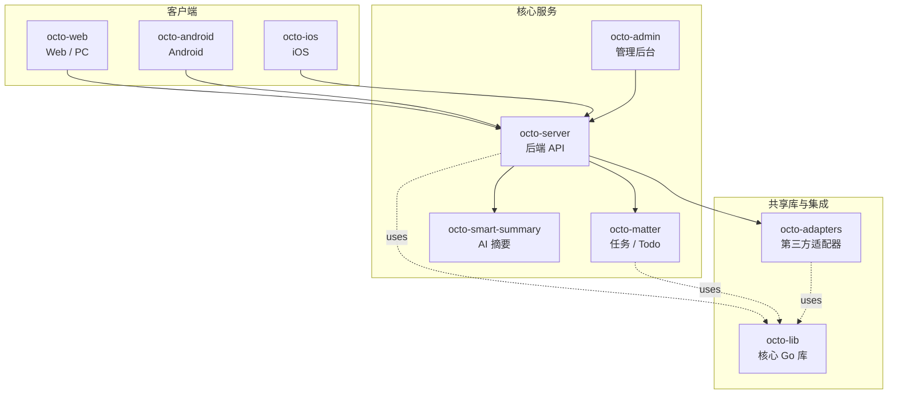

<p align="center">
  
  
</p>

<p align="center">
  <b>OCTO —— 为人和 AI Agent 协作而生的开源工作平台。</b><br/>
  <sub>让 <b>龙虾（Lobster / OpenClaw-powered digital double agents）</b>去「思」和「行」，让人专注于「品」。</sub>
</p>

<p align="center">
  <a href="https://github.com/Mininglamp-OSS"><b>🏠 OCTO 主页</b></a> ·
  <a href="#-快速开始"><b>🚀 快速开始</b></a> ·
  <a href="#-octo-生态"><b>📦 生态</b></a> ·
  <a href="./CONTRIBUTING.zh.md"><b>🤝 贡献</b></a>
</p>

<p align="center">
  <a href="./LICENSE"></a>
  <a href="./README.md"></a>
</p>

---

> 🌐 **语言**: [English](README.md) · **简体中文**

# OCTO Web（简体中文）

> **Web、PC（Electron）与 PC（.NET MAUI）客户端** —— 同一仓库，多种交付形态。

`octo-web` 是基于 pnpm / turbo 的 monorepo，通过 REST + WebSocket 与
[`octo-server`](https://github.com/Mininglamp-OSS/octo-server) 通信。本仓库
交付以下客户端：

- **Web**（`apps/web`）—— 标准浏览器端（React / TypeScript）
- **PC（Electron）**（`apps/web/src-election`）—— 将同一份 React 应用封装
  为 Electron 桌面客户端
- **PC（.NET MAUI）**（`apps/octo-maui`）—— 原生 .NET 8 跨平台客户端（C#），
  支持 Windows / macOS / Android / iOS
- **浏览器扩展**（`apps/extension`）—— 基于 WXT 的浏览器插件

## 🌟 为什么选 OCTO Web

- **一套 Web 代码，两种桌面壳。** 浏览器端与 Electron PC 端共享同一棵
  `apps/web/src/` —— 没有并行的 React 代码树，也不会产生 UX 漂移。另外提供
  原生 .NET MAUI 客户端，适合 .NET 技术栈的团队。
- **天生为龙虾而做的 UI。** 一等公民的 AI Agent 会话形态：流式回复、输入中
  提示、工具调用内联预览、已读回执、Agent vs 人的身份徽标。
- **原生双语壳。** 英文与简体中文开箱即用；i18n key 集中在
  `apps/web/src/locales/`，CI 上有字段完整性校验。

## 🚀 快速开始

```bash
git clone https://github.com/Mininglamp-OSS/octo-web.git
cd octo-web
pnpm install
pnpm dev
```

默认会连接 `http://localhost:8080` 的 `octo-server`。如需指向自有后端，
复制 `.env.example` 为 `.env.local` 并修改其中的 `VITE_API_*` 字段。

## 📦 模块与架构

本仓库为 pnpm workspace（`pnpm-workspace.yaml`），由 turbo 编排。应用与共享
包位于 `apps/` 和 `packages/` 下：

| 路径 | 作用 |
|---|---|
| `apps/web/src/pages/` | 页面级 React 视图（会话、频道、组织、设置） |
| `apps/web/src/components/` | 通用 UI 组件（消息气泡、输入区、Agent 徽标、流式渲染器） |
| `apps/web/src/store/` | 客户端状态（认证、频道、草稿、Agent 编排 UI 状态） |
| `apps/web/src/api/` | 与 `octo-server` 通信的 REST + WebSocket 客户端 |
| `apps/web/src/locales/` | 多语言资源（英文 · 简体中文） |
| `apps/web/src-election/` | PC 端 Electron 主进程 / 渲染进程 bootstrap |
| `apps/web/src-tauri/` | Tauri 壳（实验性） |
| `apps/octo-maui/` | .NET MAUI 原生 PC / 移动端客户端（C# / .NET 8） |
| `apps/extension/` | 浏览器扩展（WXT） |
| `packages/` | 内部共享库（dmworklogin、dmworkbase、dmworkcontacts 等） |
| `docs/` | 设计文档、架构说明、截图 |

关键构建目标：

```bash
pnpm dev             # 启动 Web 开发服务器
pnpm dev-ele         # Electron 壳加载 dev 构建运行
pnpm build           # 构建浏览器产物
pnpm build-ele       # 构建并打包 Electron PC 产物
pnpm build-ele:win   # 仅打包 Windows Electron 产物
pnpm build-ele:mac   # 仅打包 macOS Electron 产物
pnpm build-ele:linux # 仅打包 Linux Electron 产物
pnpm test            # 单元测试与组件测试
```

PC 端 Electron 壳（`apps/web/src-election/`）刻意做得很薄 —— 它宿主相同的
React 应用，并通过 IPC 转发原生能力（托盘、通知、文件拖拽、自动更新）。
浏览器端不依赖任何 Electron。

.NET MAUI 客户端（`apps/octo-maui/`）使用 .NET 8 SDK 独立构建，详见
[`apps/octo-maui/README.md`](apps/octo-maui/README.md)。它不依赖 pnpm / Node
工具链，提供原生桌面体验，支持服务端地址发现、企业 OIDC/SSO 登录以及引导式
初始连接配置。

## 🔗 OCTO 生态

<!-- 共享片段：OCTO 仓库矩阵。9 个仓库之间保持一致。 -->



| 仓库 | 语言 | 职责 |
|---|---|---|
| [`octo-server`](https://github.com/Mininglamp-OSS/octo-server) | Go | 后端 API · 业务编排 · 龙虾 Agent 调度 |
| [`octo-matter`](https://github.com/Mininglamp-OSS/octo-matter) | Go | 任务 / Todo / Matter 微服务 |
| [`octo-smart-summary`](https://github.com/Mininglamp-OSS/octo-smart-summary) | Go | 基于 LLM 的会话摘要服务 |
| [`octo-web`](https://github.com/Mininglamp-OSS/octo-web) | TypeScript / React + C# | Web、PC（Electron）与 PC（.NET MAUI）客户端 |
| [`octo-android`](https://github.com/Mininglamp-OSS/octo-android) | Kotlin / Java | 原生 Android 客户端 |
| [`octo-ios`](https://github.com/Mininglamp-OSS/octo-ios) | Swift / Objective-C | 原生 iOS 客户端 |
| [`octo-admin`](https://github.com/Mininglamp-OSS/octo-admin) | TypeScript / React | 管理后台（租户 / 组织 / 用户 / 频道管理） |
| [`octo-lib`](https://github.com/Mininglamp-OSS/octo-lib) | Go | 共享核心库（协议 / 加密 / 存储 / HTTP） |
| [`octo-adapters`](https://github.com/Mininglamp-OSS/octo-adapters) | TypeScript / Python | 第三方集成（IM 桥接、AI 渠道） |

## 🧭 设计哲学

OCTO 遵循三条共用原则 —— 这套矩阵里的每个仓都一致：

1. **本地优先（Local-first）。** 能跑在用户本机的一切（对话、向量、智能体）都应尽量在本机完成。你的数据属于你；云是可选项，不是前置条件。
2. **人做「品」，AI 做「思」与「行」。** 人聚焦在品味（什么重要、什么对、该发什么）。龙虾（OpenClaw 驱动的数字分身）承担思考与执行。
3. **Release-as-product（每次发布即产品）。** 每一次开源切片都是一个自洽的产品，不是代码倾倒：一个 release 一次 squash，Apache 2.0，不夹带内部包袱，单仓即可复现。

## 🤝 贡献

欢迎提 Pull Request！开 PR 前请先读：

- [CONTRIBUTING.zh.md](CONTRIBUTING.zh.md) —— 工作流、分支模型、commit 规范
- [CODE_OF_CONDUCT.zh.md](CODE_OF_CONDUCT.zh.md) —— 社区行为准则

安全问题请按 [SECURITY.zh.md](SECURITY.zh.md) 上报，不要走公开 issue。

## 📄 许可

Apache License 2.0 —— 完整文本见 [LICENSE](LICENSE)，第三方致谢见 [NOTICE](NOTICE)。

## 🙏 致谢

`octo-web` 的初始脚手架来自以下开源项目：

- **[TangSengDaoDaoWeb](https://github.com/TangSengDaoDao/TangSengDaoDaoWeb)** —— 上游项目，由 TangSengDaoDao 团队开发。
- **[WuKongIM](https://github.com/WuKongIM/WuKongIM)** —— 实时消息内核，由 `octo-server` 驱动。

完整的致谢与第三方组件清单见 [NOTICE](NOTICE)。

---

<p align="center">
  <sub>由 <b>OCTO Contributors</b> 🐙 共同开发 · <a href="https://github.com/Mininglamp-OSS">Mininglamp-OSS</a></sub>
</p>
